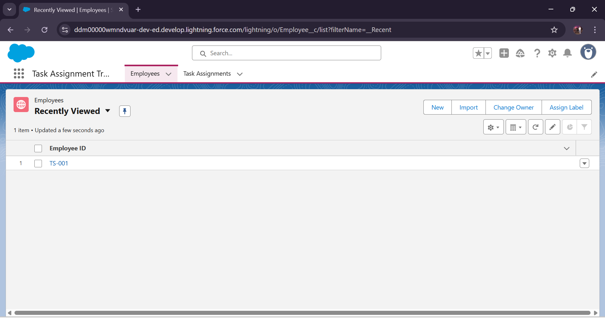
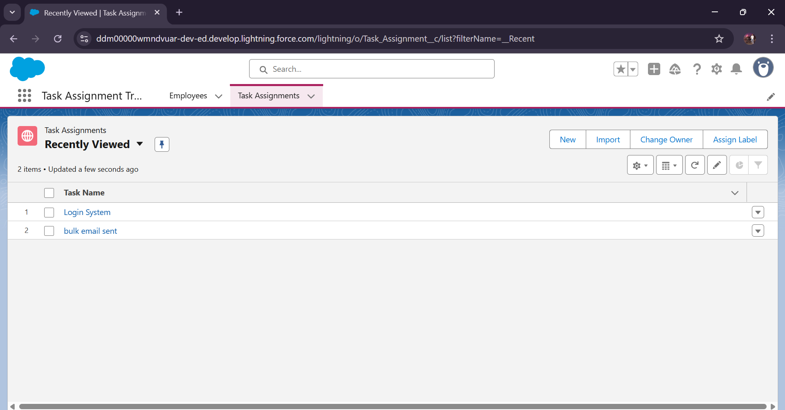
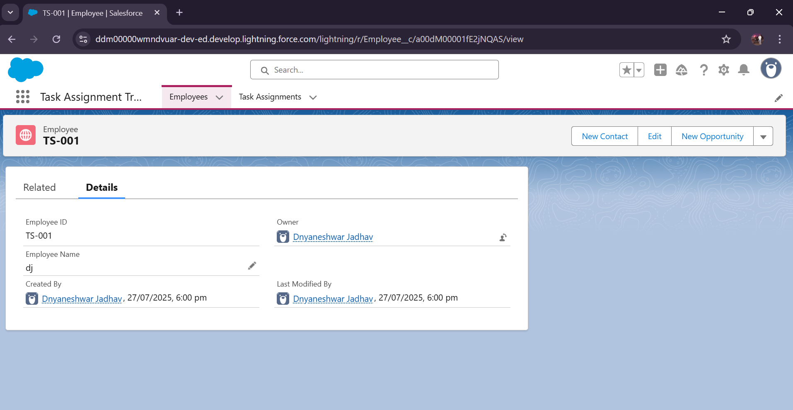
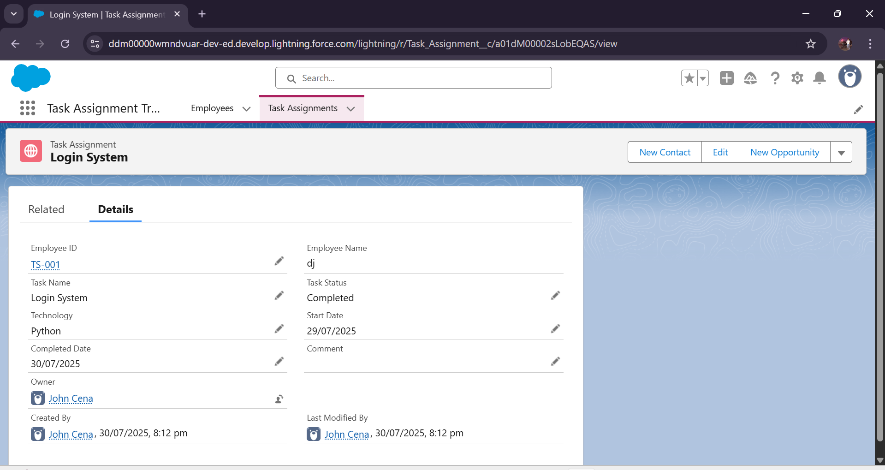
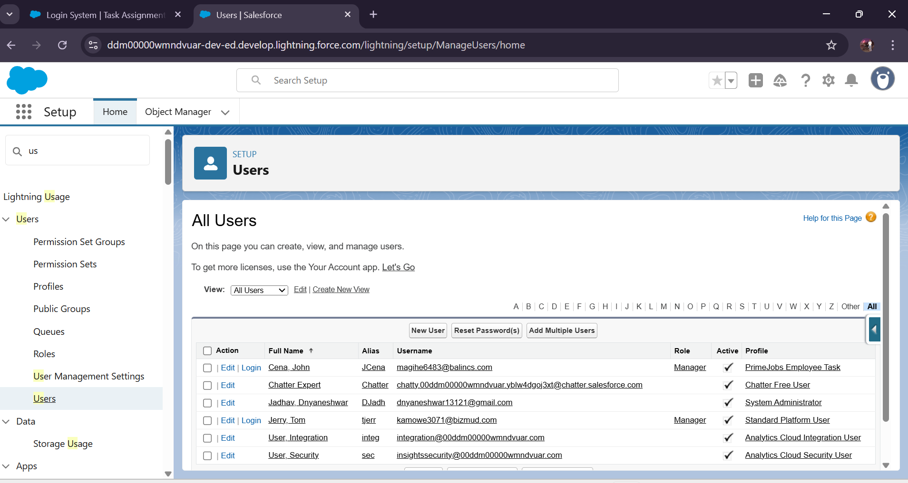
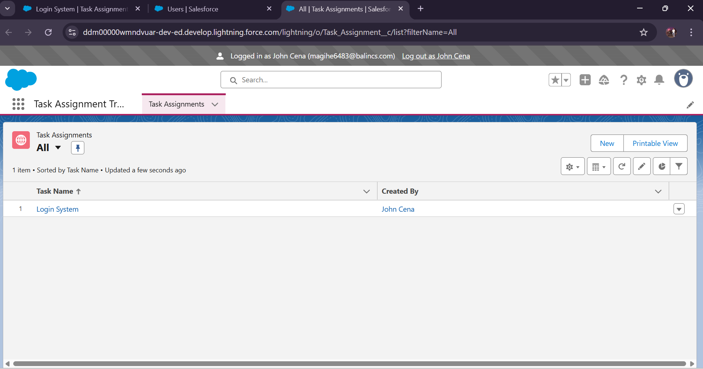
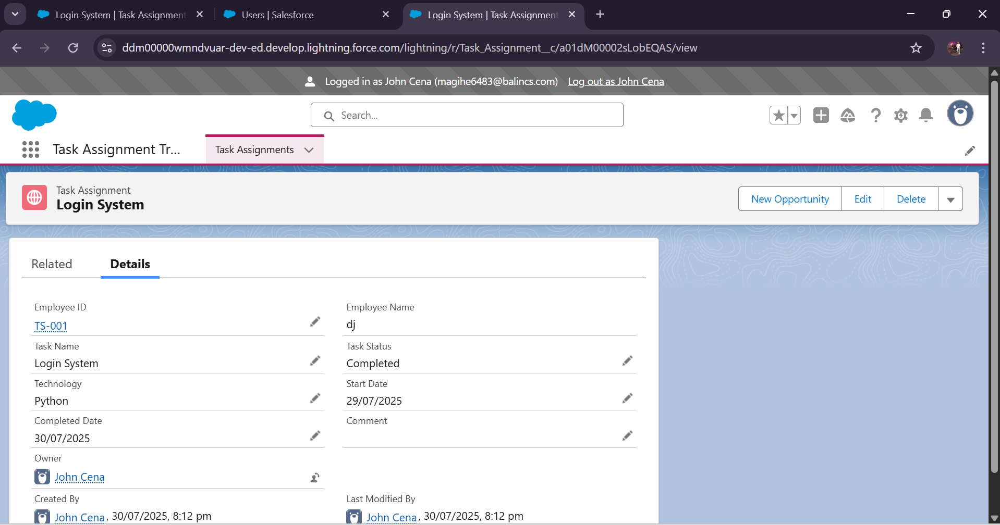

# **Task Assignment Tracker**

## **Overview**
The **Task Assignment Tracker** is a Salesforce-based application designed to streamline task management, assignment, and tracking across teams. It enables managers to assign tasks, monitor progress, and ensure timely completion, while users can easily view, update, and collaborate on their assignments.  
This project demonstrates a complete Salesforce configuration process, from app creation to security settings, following industry-standard best practices.

---

## **Business Use Case**
In fast-paced corporate environments, managing tasks across multiple team members can become challenging.  
The **Task Assignment Tracker** provides:
- A **centralized platform** to manage all tasks.
- **Role-based access** to maintain data security.
- **Customizable views and layouts** for different user profiles.
- **Validation rules** to ensure data accuracy.

---

## **Business Impact**
Implementing the **Task Assignment Tracker** can provide companies with:
- **Increased Productivity** – Managers spend less time tracking tasks manually.  
- **Improved Accountability** – Employees clearly see their assigned work and deadlines.  
- **Enhanced Data Security** – Role- and profile-based access ensures sensitive information stays protected.  
- **Better Decision-Making** – Filtered list views and reporting help identify delays and resource bottlenecks early.  
- **Scalability** – The system can be easily adapted for larger teams and complex workflows.  

---

## **Key Features & Implementation Steps**
The application was implemented step-by-step using Salesforce Admin features:

1. **Create a Salesforce App**  
2. **Create Salesforce Objects with Tabs**  
3. **Add Object to App**  
4. **Create Fields** (Custom fields for task details like Due Date, Priority, Status, etc.)  
5. **Apply Validation Rules** (e.g., Due Date cannot be in the past)  
6. **Create Record Types** (Different task categories)  
7. **Customize Page Layouts** for better user experience  
8. **Create Profiles** with appropriate access  
9. **Create Roles** for data hierarchy  
10. **Create Users** and assign roles  
11. **Setup App-Level Security**  
12. **Setup Object-Level Security**  
13. **Setup Record-Level Security**  
14. **Setup Tab Visibility**  
15. **Create List Views** for quick task filtering  

---

## **Technical Stack**
- **Platform:** Salesforce  
- **Role:** Salesforce Administrator  
- **Skills Used:**  
  - App, Object, and Field creation  
  - Record Types & Page Layouts  
  - Roles, Profiles, and Security Settings  
  - Validation Rules  
  - List Views and UI Customization  

---

## **Screenshots**
 
  
  
  
  
  
  
  

---

## **Project Diagram**

---

## **Skills Demonstrated**
- **Salesforce CRM Customization**
- **Data Security & Access Control**
- **UI Configuration in Salesforce**
- **Business Requirement Implementation**
- **Problem-Solving in Task Management Scenarios**

---

## **Installation & Setup**
1. Login to Salesforce (Developer Edition or Sandbox).  
2. Create the app and objects as per the steps in **Key Features & Implementation Steps**.  
3. Configure security, profiles, and roles.  
4. Deploy to your Salesforce org for testing.  

---

## **Author**
**[Dnyaneshwar Jadhav]**  
Aspiring Salesforce Administrator | CRM Enthusiast  
📧 Email:dnyaneshwar13121@gmail.com  
 

